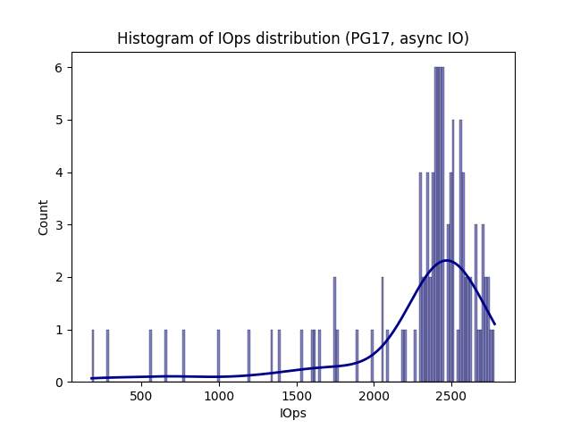
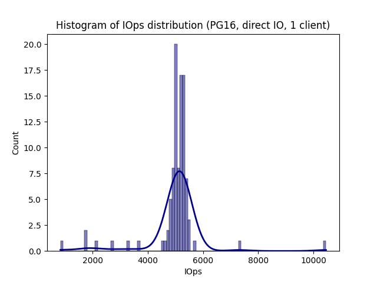
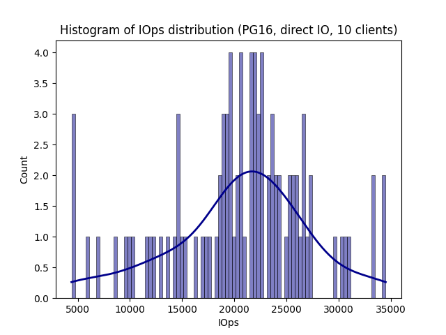
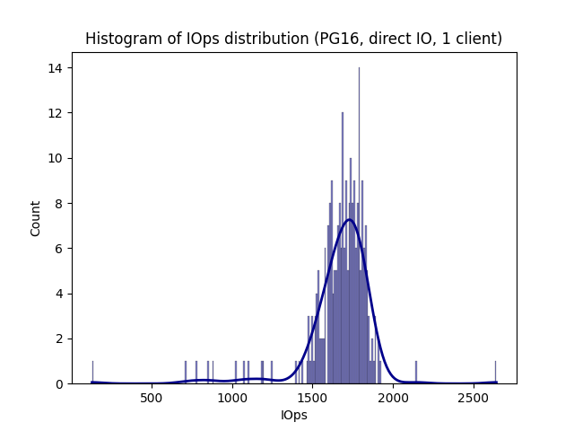

### Tracing select statement process with strace

To find out which systemcalls are done when a postgres select statement happens, I used strace. I'm planning to later measure the IO latency during a query using the systemcalls, that are called during execution of the select statement.

I created a table with 500 000 lines and used the following select statement:

`SELECT * FROM table_name;`

Using strace on the postgresql parent PID yielded the following results:

`strace -f -e trace=all -p $(pgrep postgres | head -n1)`

The preadv() systemcalls are visible; I'll try to use these for IO read latency measurement.

### Instrumenting USDT's to measure query latency

PostgreSQL provides USDT's if compiled with the according flag (--enable-dtrace). Because postgres was running in a container here, I had to get the correct container's PID and access the USDT's via the /proc directory:

```text
bpftrace -l usdt:/proc/3878649/root/usr/lib/postgresql/17/bin/postgres:*
usdt:/proc/3878649/root/usr/lib/postgresql/17/bin/postgres:postgresql:buffer__checkpoint__done
usdt:/proc/3878649/root/usr/lib/postgresql/17/bin/postgres:postgresql:buffer__checkpoint__start
usdt:/proc/3878649/root/usr/lib/postgresql/17/bin/postgres:postgresql:buffer__checkpoint__sync__start
usdt:/proc/3878649/root/usr/lib/postgresql/17/bin/postgres:postgresql:buffer__extend__done
usdt:/proc/3878649/root/usr/lib/postgresql/17/bin/postgres:postgresql:buffer__extend__start
usdt:/proc/3878649/root/usr/lib/postgresql/17/bin/postgres:postgresql:buffer__flush__done
usdt:/proc/3878649/root/usr/lib/postgresql/17/bin/postgres:postgresql:buffer__flush__start
usdt:/proc/3878649/root/usr/lib/postgresql/17/bin/postgres:postgresql:buffer__read__done
usdt:/proc/3878649/root/usr/lib/postgresql/17/bin/postgres:postgresql:buffer__read__start
usdt:/proc/3878649/root/usr/lib/postgresql/17/bin/postgres:postgresql:buffer__sync__done
usdt:/proc/3878649/root/usr/lib/postgresql/17/bin/postgres:postgresql:buffer__sync__start
usdt:/proc/3878649/root/usr/lib/postgresql/17/bin/postgres:postgresql:buffer__sync__written
usdt:/proc/3878649/root/usr/lib/postgresql/17/bin/postgres:postgresql:checkpoint__done
usdt:/proc/3878649/root/usr/lib/postgresql/17/bin/postgres:postgresql:checkpoint__start
usdt:/proc/3878649/root/usr/lib/postgresql/17/bin/postgres:postgresql:clog__checkpoint__done
[...]
```

Calculating time between the `postgres:postgresql:query__start` and `postgres:postgresql:query__done` probes:

```text
bpftrace usdt_test.bt
Attaching 4 probes...
PostgreSQL statement execution analyzer.
Time in microseconds (us).
pid   :Phase      :time to phase :time in phase : query
------|-----------|--------------|--------------|------
[4034334]Query start:              :              : vacuum pgbench_branches
[4034334]Query done : (       414) :           414: vacuum pgbench_branches
[4034334]Query start:              :              : vacuum pgbench_tellers
[4034334]Query done : (       157) :           157: vacuum pgbench_tellers
[4034334]Query start:              :              : truncate pgbench_history
[4034334]Query done : (       981) :           981: truncate pgbench_history
[4034335]Query start:              :              : SELECT * FROM pgbench_accounts;
[4034335]Query done : (    211722) :        211722: SELECT * FROM pgbench_accounts;
[4034335]Query start:              :              : SELECT * FROM pgbench_accounts;
[4034335]Query done : (    205086) :        205086: SELECT * FROM pgbench_accounts;
[4034335]Query start:              :              : SELECT * FROM pgbench_accounts;
[4034335]Query done : (    202960) :        202960: SELECT * FROM pgbench_accounts;
[4034335]Query start:              :              : SELECT * FROM pgbench_accounts;
[4034335]Query done : (    201454) :        201454: SELECT * FROM pgbench_accounts;
[4034335]Query start:              :              : SELECT * FROM pgbench_accounts;
[4034335]Query done : (    213973) :        213973: SELECT * FROM pgbench_accounts;
[4034335]Query start:              :              : SELECT * FROM pgbench_accounts;
[4034335]Query done : (    194772) :        194772: SELECT * FROM pgbench_accounts;
[4034335]Query start:              :              : SELECT * FROM pgbench_accounts;
[4034335]Query done : (    202489) :        202489: SELECT * FROM pgbench_accounts;
[4034335]Query start:              :              : SELECT * FROM pgbench_accounts;
[4034335]Query done : (    201386) :        201386: SELECT * FROM pgbench_accounts;
[4034335]Query start:              :              : SELECT * FROM pgbench_accounts;
[4034335]Query done : (    209295) :        209295: SELECT * FROM pgbench_accounts;
[4034335]Query start:              :              : SELECT * FROM pgbench_accounts;
[4034335]Query done : (    202439) :        202439: SELECT * FROM pgbench_accounts;
[4034335]Query start:              :              : SELECT * FROM pgbench_accounts;
[4034335]Query done : (    191400) :        191400: SELECT * FROM pgbench_accounts;
[4034335]Query start:              :              : SELECT * FROM pgbench_accounts;
[4034335]Query done : (    208308) :        208308: SELECT * FROM pgbench_accounts;
[4034335]Query start:              :              : SELECT * FROM pgbench_accounts;
[4034335]Query done : (    195276) :        195276: SELECT * FROM pgbench_accounts;
[4034335]Query start:              :              : SELECT * FROM pgbench_accounts;
[4034335]Query done : (    201337) :        201337: SELECT * FROM pgbench_accounts;
[4034335]Query start:              :              : SELECT * FROM pgbench_accounts;
[4034335]Query done : (    204130) :        204130: SELECT * FROM pgbench_accounts;
[4034335]Query start:              :              : SELECT * FROM pgbench_accounts;
[4034335]Query done : (    201296) :        201296: SELECT * FROM pgbench_accounts;
[4034335]Query start:              :              : SELECT * FROM pgbench_accounts;
[4034335]Query done : (    201408) :        201408: SELECT * FROM pgbench_accounts;
[4034335]Query start:              :              : SELECT * FROM pgbench_accounts;
[4034335]Query done : (    202892) :        202892: SELECT * FROM pgbench_accounts;
[4034335]Query start:              :              : SELECT * FROM pgbench_accounts;
[4034335]Query done : (    197219) :        197219: SELECT * FROM pgbench_accounts;
[4034335]Query start:              :              : SELECT * FROM pgbench_accounts;
[4034335]Query done : (    202364) :        202364: SELECT * FROM pgbench_accounts;
[4034490]Query start:              :              : -- ping
[4034490]Query done : (        47) :            47: -- ping
```

I executed the same select statement 20 times using pgbench, which can be seen here. Latency is about 200ms on average.

Important: when using the local-volume-provisioner, there are no block devices created. Instead, directory-based volumes are used -> we have to trace systemcalls like read() or write() instead of using block tracepoints. --> wrong, there was just no IO because the DB was too small

TODO show this

# Local-Path storage provider
##### using PG17, cache enabled

#### Analysis
* time from clone() to wait4() is not IO latency but just process runtime (one might consider that query latency).
* time to complete preadv() operations as seen in the strace for the child process that postgres spawns (child process runs the queries) would be IO latency

### How much of the query time is spent on IO? Whats the IO latency?
Increased DB size as no IO was present (so that read data was bigger than postgres&os caches).

Postgres 17 with cache enabled:
Running 10 queries and tracing block IO latency per PID:

```console
Attaching 4 probes...
Monitoring pgbench for I/O latency...
^CAverage latency: 898204 ns


@io_count: 53843
@pgbench_pid: 1541677
@timestamps[8388640, 4262560]: 2963643001510604
@timestamps[8388608, 228280328]: 2963651301372539
@timestamps[8388608, 233921464]: 2963710553624990
@timestamps[8388608, 225983536]: 2963712750546513
@timestamps[8388608, 225983568]: 2963712750569761
@timestamps[8388608, 227793984]: 2963745635807680
@timestamps[8388608, 226132544]: 2963760159075657
@timestamps[8388608, 226135688]: 2963760164017068
@timestamps[8388640, 3444424]: 2963774559032762
@total_latency_ns: 48362020827

@usecs:
[64, 128)            452 |                                                    |
[128, 256)         12703 |@@@@@@@@@@@@@@@@@@@@@@@@                            |
[256, 512)          4931 |@@@@@@@@@                                           |
[512, 1K)          26867 |@@@@@@@@@@@@@@@@@@@@@@@@@@@@@@@@@@@@@@@@@@@@@@@@@@@@|
[1K, 2K)            8169 |@@@@@@@@@@@@@@@                                     |
[2K, 4K)             651 |@                                                   |
[4K, 8K)              49 |                                                    |
[8K, 16K)             11 |                                                    |
[16K, 32K)             2 |                                                    |
[32K, 64K)             6 |                                                    |
[64K, 128K)            1 |                                                    |
[128K, 256K)           0 |                                                    |
[256K, 512K)           0 |                                                    |
[512K, 1M)             0 |                                                    |
[1M, 2M)               0 |                                                    |
[2M, 4M)               0 |                                                    |
[4M, 8M)               1 |                                                    |
```

REDO for postgres 16

TODO add histogram

Per query total (accumulated) IO latency was 4836ms. The queries had run times of avg. 16 seconds (see pgbench output).
That means per query, 4836ms were spent in IO block operations, whereas the rest of the query runtime was spent elsewhere. This could include waiting and scheduling times (CPU as well), time to receive data from the cache, ...

This might mean that the application is not IO-bound. I took a look into htop and saw that while the select statements are executed, postgres constantly shows a CPU usage of >95% -> the application is probably CPU-bound instead.

In general IO latency was around 900ns on average.

```
$ pgbench -f /var/lib/postgresql/data/test.sql -h localhost -d app -U app -t 10 -c 1
Password:
pgbench (17.0 (Debian 17.0-1.pgdg110+1))
starting vacuum...end.
transaction type: /var/lib/postgresql/data/test.sql
scaling factor: 1
query mode: simple
number of clients: 1
number of threads: 1
maximum number of tries: 1
number of transactions per client: 10
number of transactions actually processed: 10/10
number of failed transactions: 0 (0.000%)
latency average = 15949.566 ms
initial connection time = 7.142 ms
tps = 0.062698 (without initial connection time)
```

Postgres 17 Cache enabled:
Measuring time it takes to complete preadv() operations (strace of the postgres process running the queries yielded, that this syscall was used):
```console
@hist:
[1]                   27 |                                                    |
[2, 4)               421 |                                                    |
[4, 8)               684 |                                                    |
[8, 16)            87581 |@@@@@@@@@@@@@@@@@@@@@@@@@@@@@@@@@@@@@               |
[16, 32)          120006 |@@@@@@@@@@@@@@@@@@@@@@@@@@@@@@@@@@@@@@@@@@@@@@@@@@@@|
[32, 64)            6083 |@@                                                  |
[64, 128)          19000 |@@@@@@@@                                            |
[128, 256)         13893 |@@@@@@                                              |
[256, 512)          2537 |@                                                   |
[512, 1K)            639 |                                                    |
[1K, 2K)             559 |                                                    |
[2K, 4K)              66 |                                                    |
[4K, 8K)              14 |                                                    |
[8K, 16K)             10 |                                                    |
```

No clear Bi-Modal distribution, supposedly 1-32us is reading data from cache and 64-512us are slower operations reading data from the disk.

#### How much time is spent on preadv() operations?

I ran the query 10 times and measured the time that was spent in preadv() oeprations overall (accumulated per query):

```console
@io_latency[3816425]: 316308
@io_latency[3817355]: 316955
@io_latency[3814594]: 360429
@io_latency[3817830]: 430263
@io_latency[3815002]: 438407
@io_latency[3815930]: 442812
@io_latency[3816797]: 452999
@io_latency[3815387]: 518351
@io_latency[3814077]: 538984
@io_latency[3813414]: 701048

@us:
[2, 4)                 8 |                                                    |
[4, 8)               108 |                                                    |
[8, 16)            55346 |@@@@@@@@@@@@@@@@@@@@@@@@@@@@@@@@@@@@@@@@@@@@@@@@@@@@|
[16, 32)           51286 |@@@@@@@@@@@@@@@@@@@@@@@@@@@@@@@@@@@@@@@@@@@@@@@@    |
[32, 64)            1849 |@                                                   |
[64, 128)          13255 |@@@@@@@@@@@@                                        |
[128, 256)          3962 |@@@                                                 |
[256, 512)           880 |                                                    |
[512, 1K)            244 |                                                    |
[1K, 2K)             116 |                                                    |
[2K, 4K)               5 |                                                    |
[4K, 8K)               2 |                                                    |
```

The time spent in preadv() syscalls ranged from 316ms to 701ms, whereas the time spent in block IO operations amounted to ~4800ms. This meant that there is probably asynchronous IO being used, and that preadv() operations often don't lead to a block for the full duration of a block IO operation (therefore the differing values).

Postgres 17 uses vectored IO (clustering multiple pread64() syscalls into one preadv() syscall which might be harder to debug), so I decided to switch to Postgres 16.

-> elaborate on what's the problem with the preadv syscalls

## using PG16, with async IO

Postgres 16 with AIO enabled: measuring time to complete pread64() syscalls:

```console
@io_latency[3427879]: 997574
@io_latency[3425873]: 1013732
@io_latency[3426775]: 1104702
@io_latency[3428305]: 1117097
@io_latency[3426293]: 1136607
@io_latency[3425221]: 1158294
@io_latency[3427377]: 1178957
@io_latency[3424745]: 1195139
@io_latency[3428845]: 1209701
@io_latency[3424223]: 1470620

@us:
[0]                  180 |                                                    |
[1]              3273009 |@@@@@@@@@@@@@@@@@@@@@@@@@@@@@@@@@@@@@@@@@@@@@@@@@@@@|
[2, 4)            732028 |@@@@@@@@@@@                                         |
[4, 8)             40709 |                                                    |
[8, 16)            10482 |                                                    |
[16, 32)            1380 |                                                    |
[32, 64)             985 |                                                    |
[64, 128)          23941 |                                                    |
[128, 256)         16977 |                                                    |
[256, 512)          1004 |                                                    |
[512, 1K)            328 |                                                    |
[1K, 2K)             120 |                                                    |
[2K, 4K)              22 |                                                    |
[4K, 8K)               8 |                                                    |
[8K, 16K)              4 |                                                    |
[16K, 32K)             0 |                                                    |
[32K, 64K)             1 |                                                    |
```

In PG16, per query (process), around 1100ms of the query time are spent in pread64() operations. Whereas around 4800ms are spent in block IO operations -> probably Asynchronous IO is happening. pread64() may again not always block for the full duration that disk I/O takes to complete. Also, the application was not IO-bound here.

For testing purposes I then disabled the use of asynchronous IO, which can be forced by using the debug parameter `debug_direct_io`.

Disabling asynchronous IO made the application IO-bound:
* query took a lot longer
* in iostat, 100% IO usage and IO wait of around 20% can be observed

Reduced the DB size as queries took a lot longer when using direct IO.

## using PG16, with direct IO

#### Query duration (USDTs):

```console
[3942982]Query done : (        64) :            64: -- ping
[3942899]Query done : (   7802983) :       7802983: SELECT * FROM pgbench_accounts;
[3942899]Query start:              :              : SELECT * FROM pgbench_accounts;
[3943335]Query start:              :              : -- ping
[3943335]Query done : (        42) :            42: -- ping
[3942899]Query done : (   7850340) :       7850340: SELECT * FROM pgbench_accounts;
[3942899]Query start:              :              : SELECT * FROM pgbench_accounts;
[3943598]Query start:              :              : -- ping
[3943598]Query done : (        53) :            53: -- ping
[3942899]Query done : (   7974342) :       7974342: SELECT * FROM pgbench_accounts;
[3942899]Query start:              :              : SELECT * FROM pgbench_accounts;
[3942899]Query done : (   7663468) :       7663468: SELECT * FROM pgbench_accounts;
[3942899]Query start:              :              : SELECT * FROM pgbench_accounts;
[3943847]Query start:              :              : -- ping
[3943847]Query done : (        53) :            53: -- ping
[3942899]Query done : (   7979018) :       7979018: SELECT * FROM pgbench_accounts;
[3942899]Query start:              :              : SELECT * FROM pgbench_accounts;
[3944089]Query start:              :              : -- ping
[3944089]Query done : (        42) :            42: -- ping
[3942899]Query done : (   7980232) :       7980232: SELECT * FROM pgbench_accounts;
[3942899]Query start:              :              : SELECT * FROM pgbench_accounts;
[3944387]Query start:              :              : -- ping
[3944387]Query done : (        78) :            78: -- ping
[3942899]Query done : (   7723262) :       7723262: SELECT * FROM pgbench_accounts;
[3942899]Query start:              :              : SELECT * FROM pgbench_accounts;
[3944648]Query start:              :              : -- ping
[3944648]Query done : (        40) :            40: -- ping
[3942899]Query done : (   7600260) :       7600260: SELECT * FROM pgbench_accounts;
[3942899]Query start:              :              : SELECT * FROM pgbench_accounts;
[3944994]Query start:              :              : -- ping
[3944994]Query done : (       100) :           100: -- ping
[3942899]Query done : (   7856708) :       7856708: SELECT * FROM pgbench_accounts;
[3942899]Query start:              :              : SELECT * FROM pgbench_accounts;
[3942899]Query done : (   7791054) :       7791054: SELECT * FROM pgbench_accounts;
[3945259]Query start:              :              : -- ping
```
Average query duration was 7822,166 ms.

#### Block IO latency
Measuring block IO latency, I executed the select statement 10 times here:

```console
Attaching 4 probes...
Monitoring postgres block I/O latency...
Average latency: 144032 ns

@io_count: 411020
@pg_pid: 3854574

@total_latency_ns: 59200377302
@usecs:
[64, 128)          57168 |@@@@@@@@                                            |
[128, 256)        351301 |@@@@@@@@@@@@@@@@@@@@@@@@@@@@@@@@@@@@@@@@@@@@@@@@@@@@|
[256, 512)          1975 |                                                    |
[512, 1K)            386 |                                                    |
[1K, 2K)             152 |                                                    |
[2K, 4K)              37 |                                                    |
[4K, 8K)               0 |                                                    |
[8K, 16K)              0 |                                                    |
[16K, 32K)             3 |                                                    |
```

In contrast to PG17, when using PG16 with direct IO, block IO operations accounted for most of the query response time. Block IO operations took mostly around 128-256 us and overall accounted for 5920 ms of time spent in IO on average (= 75% of the 7822 ms query response time).

#### IO time occupied by pread64() syscalls

Accumulating time spent in pread64() syscalls:

```console
@io_latency[3958941]: 61766041

@us:
[64, 128)          20004 |@@                                                  |
[128, 256)        388333 |@@@@@@@@@@@@@@@@@@@@@@@@@@@@@@@@@@@@@@@@@@@@@@@@@@@@|
[256, 512)          2841 |                                                    |
[512, 1K)            937 |                                                    |
[1K, 2K)             228 |                                                    |
[2K, 4K)              57 |                                                    |
[4K, 8K)               9 |                                                    |
```

Here ~6176ms were spent in pread64() syscalls, which is slightly more than the time spent in block IO operations. This makes sense, as the time spent in the syscall does not only include the block IO operation, but also IO waiting times, the overhead of the syscall, ... TODO

In contrast to when I used PG17 with AIO enabled, (there time in preadv syscalls amounted to way less than the time in block IO operations), when using direct IO, the time spent in pread64() syscalls does match up with the time spent in block IO operations.
After some more investigation on how the preadv() syscall works, I figured that it can initiate multiple read operations in order to read into multiple buffers. This is often used to achieve asynchronous IO in threaded applications (because the main thread can still perform other operations while IO is running)
**--> Using preadv, the IO operations may continue running in the background after block IO operations have been initiated (but not finished yet)**

## IOps

As a second metric I looked at IOps. To measure them for the postgres processes I counted read and write syscalls:

Postgres 17 with AIO enabled:
```console
Parent 'postgres' IOPS: 0
Parent 'postgres' IOPS: 1200
Parent 'postgres' IOPS: 2428
Parent 'postgres' IOPS: 2407
Parent 'postgres' IOPS: 2344
Parent 'postgres' IOPS: 2713
Parent 'postgres' IOPS: 2628
Parent 'postgres' IOPS: 2440
Parent 'postgres' IOPS: 2501
Parent 'postgres' IOPS: 2612
Parent 'postgres' IOPS: 2399
Parent 'postgres' IOPS: 1749
Parent 'postgres' IOPS: 0
Parent 'postgres' IOPS: 0
```

Plotting data as a histogram: 

## PG16 with direct IO enabled

IOps observed when using direct IO in PG16 are higher, as the AIO in PG17 clusters multiple pread64() syscalls into one preadv() syscall. Also they're higher mostly because I enabled direct IO, which minimizes caching effects.
Script output:

```console
Attaching 4 probes...
Parent 'postgres' IOPS: 5436
Parent 'postgres' IOPS: 5375
Parent 'postgres' IOPS: 5708
Parent 'postgres' IOPS: 5756
Parent 'postgres' IOPS: 3491
Parent 'postgres' IOPS: 5374
Parent 'postgres' IOPS: 5101
Parent 'postgres' IOPS: 5081
Parent 'postgres' IOPS: 5409
Parent 'postgres' IOPS: 5540
Parent 'postgres' IOPS: 5421
Parent 'postgres' IOPS: 5435
Parent 'postgres' IOPS: 3892
```



The count of pread64() and pwrite64() syscalls matched up with the outputs of `iostat -sx 1` as well:
```console
avg-cpu:  %user   %nice %system %iowait  %steal   %idle
           7.56    0.00    6.30   18.14    0.00   68.01

Device             tps      kB/s    rqm/s   await aqu-sz  areq-sz  %util
sda            5690.00  45828.00   221.00    0.15   0.84     8.05 100.00
sdb               0.00      0.00     0.00    0.00   0.00     0.00   0.00
sdc               2.00      8.00     0.00    0.50   0.00     4.00   0.40
```

Although disk usage is 100%, no high latency can be observed for block IO operations (avg. between 128 and 256 microseconds). Performance of the query is therefore being limited by IOps, and the block IO operations themselves don't experience any high latencies - as these are sequential reads and the disk can handle them efficiently.

IO latency and IOps seem to stay the same when I increased the database size (by 200%) - so probably query runtime is limited by the disk's capacity of performing read operations, IOps.

When increasing the number of clients in pgbench (to 10), IOps increased because queries were now run by multiple clients in parallel. However IO latency stayed the same:



For reference: testing disk IOps and IO latency with fio (running with 1 client) delivers similar results:

```text
lat (usec): min=105, max=91707, avg=158.81, stdev=229.20
read: IOPS=6276, BW=49.0MiB/s (51.4MB/s)(2942MiB/60001msec)
```
<!-- 
The higher latency is explained by postgres partially reading data from the OS cache (as I didn't clear the OS cache after every time running the experiment, frequently accessed data will be cached there). Postgres also has its own shared buffer cache, but I set this to the minimum value here (128kB) and didn't encounter any cache hits on the Postgres side. Hits on this Postgres buffer would be shown as `Buffers: shared hit=x`. => probably not OS cache as I used direct IO, but the effect of the Postgres query execution plan
-->

```sql
app=> explain (analyze, buffers) select * from pgbench_accounts;
                                                          QUERY PLAN
------------------------------------------------------------------------------------------------------------------------------
 Seq Scan on pgbench_accounts  (cost=0.00..65984.00 rows=2500000 width=97) (actual time=0.246..6426.156 rows=2500000 loops=1)
   Buffers: shared read=40984
```

Latency distribution when running fio - REDO, incorrect results:


```console
fio --filename=/datadir/datafile --direct=1 --rw=read --bs=8k --ioengine=libaio --numjobs=1 --size=5G --runtime=60 --time_based --group_reporting
Attaching 4 probes...
Monitoring pgbench for I/O latency...
Average latency: 150155 ns

@io_count: 760588
@pgbench_pid: 1869793
@timestamps[8388608, 164365904]: 372727426762384
@total_latency_ns: 114206741876
@usecs:
[64, 128)         135256 |@@@@@@@@@@@                                         |
[128, 256)        606170 |@@@@@@@@@@@@@@@@@@@@@@@@@@@@@@@@@@@@@@@@@@@@@@@@@@@@|
[256, 512)          6738 |                                                    |
[512, 1K)          11833 |@                                                   |
[1K, 2K)             411 |                                                    |
[2K, 4K)              79 |                                                    |
[4K, 8K)              12 |                                                    |
[8K, 16K)             87 |                                                    |
[16K, 32K)             2 |                                                    |
```

Results matched with the postgres select statement results (fio running with direct=1, rw=read).

<!-- -> Fio had way lower results (2000 vs 5000 IOps, 400+ vs 150ms latency): run postgres again with the cache cleared. Run Fio again multiple times (as Deployment not Job, so that PV is not deleted) -->

# Longhorn

#### Block IO latency & time spent
Performing 10 transactions and tracing block IO latency:

```console
Attaching 4 probes...
Monitoring postgres for I/O latency...
^CAverage latency: 482780 ns

@io_count: 412230
@pgbench_pid: 1800117

@total_latency_ns: 199016700544
@usecs:
[256, 512)        286167 |@@@@@@@@@@@@@@@@@@@@@@@@@@@@@@@@@@@@@@@@@@@@@@@@@@@@|
[512, 1K)         121303 |@@@@@@@@@@@@@@@@@@@@@@                              |
[1K, 2K)            3785 |                                                    |
[2K, 4K)             810 |                                                    |
[4K, 8K)             152 |                                                    |
[8K, 16K)             13 |                                                    |
```

The average query latency amounted to 22490ms seconds, of which 19901ms were spent in block IO operations. Also the average block IO latency was way higher than when using the local-path provider (avg. 480ms vs 170ms).

```console
number of transactions actually processed: 10/10
number of failed transactions: 0 (0.000%)
latency average = 22490.617 ms
initial connection time = 29.844 ms
tps = 0.044463 (without initial connection time)

[436449]Query done : (  23058928) :      23058928: SELECT * FROM pgbench_accounts;
[436449]Query start:              :              : SELECT * FROM pgbench_accounts;
[436449]Query done : (  22704079) :      22704079: SELECT * FROM pgbench_accounts;
[436449]Query start:              :              : SELECT * FROM pgbench_accounts;
[436449]Query done : (  22340557) :      22340557: SELECT * FROM pgbench_accounts;
[436449]Query start:              :              : SELECT * FROM pgbench_accounts;
[436449]Query done : (  23978260) :      23978260: SELECT * FROM pgbench_accounts;
[436449]Query start:              :              : SELECT * FROM pgbench_accounts;
[436449]Query done : (  22019559) :      22019559: SELECT * FROM pgbench_accounts;
[436449]Query start:              :              : SELECT * FROM pgbench_accounts;
[436449]Query done : (  22162707) :      22162707: SELECT * FROM pgbench_accounts;
[436449]Query start:              :              : SELECT * FROM pgbench_accounts;
[436449]Query done : (  22419991) :      22419991: SELECT * FROM pgbench_accounts;
[436449]Query start:              :              : SELECT * FROM pgbench_accounts;
[436449]Query done : (  22150983) :      22150983: SELECT * FROM pgbench_accounts;
[436449]Query start:              :              : SELECT * FROM pgbench_accounts;
[436449]Query done : (  22042618) :      22042618: SELECT * FROM pgbench_accounts;
[436449]Query start:              :              : SELECT * FROM pgbench_accounts;
[436449]Query done : (  21937736) :      21937736: SELECT * FROM pgbench_accounts;
```

#### Time spent in pread syscalls

Next I looked at the time spent in the pread64() syscall. This amounted to 21839ms, which is again on average slightly more than the time spent in block IO operations itself (due to overhead of the syscalls). Also we can see that most of the query time is actually spent in IO, which makes the application very IO-bound (to expect when using direct IO and no caches).

```console
@io_latency[398408]: 218398660

@us:
[256, 512)        212738 |@@@@@@@@@@@@@@@@@@@@@@@@@@@@@@@@@@@@@@@@@@@@@@@@@@@@|
[512, 1K)         192958 |@@@@@@@@@@@@@@@@@@@@@@@@@@@@@@@@@@@@@@@@@@@@@@@     |
[1K, 2K)            5464 |@                                                   |
[2K, 4K)            1053 |                                                    |
[4K, 8K)             148 |                                                    |
[8K, 16K)             23 |                                                    |
[16K, 32K)            55 |                                                    |
[32K, 64K)             6 |                                                    |
```

IOps values were lower as well in comparison to the local-path provisioner, when running with 1 client:



Running fio with a Longhorn-provided volume:

```console
  read: IOPS=1894, BW=14.8MiB/s (15.5MB/s)(888MiB/60001msec)
  lat (usec): min=298, max=26164, avg=526.69, stdev=380.94
```

Results corresponded with the block IO latency measurements for the Longhorn provider. The difference noticeable between the Longhorn and Local-Path providers can be seen equally in both the FIO and Postgres Select Query results. In both cases, block IO operations seem to be the actual origin of the IO latency and IOps (performance is not being lost elsewhere in the IO stack). 

Local-Path Postgres: block IO latency 150ms, IOPS 5000
Local-Path FIO: block IO latency 150ms, IOPS 6200
Longhorn Postgres: Block IO latency 480ms, IOPS 1800-1900
Longhorn FIO: BLock IO latency 530ms, IOPS 1900

When tracing time spent in block IO operations for the longhorn-engine process instead (using iotop I identified that there are longhorn processes generating IO alongside as well), I got these results:

```console
Total time spent in block I/O: 7927860 ns
Number of block I/O operations: 43435

@count: 43435
@hist:
[64, 128)            517 |                                                    |
[128, 256)         38511 |@@@@@@@@@@@@@@@@@@@@@@@@@@@@@@@@@@@@@@@@@@@@@@@@@@@@|
[256, 512)          4065 |@@@@@                                               |
[512, 1K)            301 |                                                    |
[1K, 2K)              36 |                                                    |
[2K, 4K)               3 |                                                    |
[4K, 8K)               1 |                                                    |
[8K, 16K)              1 |                                                    |
```

Here, measured avg. latency was 182,52us, closer to the values achieved using the local-path provider. Overall the longhorn-engine spent 3963us in IO per query (23800us query runtime == application-reported IO latency).

Inspecting in which syscalls the longhorn process spends most of its time:

```console
strace -f -c -p 7751
% time     seconds  usecs/call     calls    errors syscall
------ ----------- ----------- --------- --------- ----------------
 69.73   23.036466         137    167900       195 futex           <--
 12.08    3.990538          35    111611           nanosleep
 11.31    3.734883          52     71802         1 epoll_pwait
  2.66    0.877853          42     20789           pread64
  1.90    0.627041          14     43140           write
  1.22    0.401941           8     46185     22328 read
  0.53    0.173685           8     20789           fstat
  0.48    0.158652         105      1510           pwrite64
  0.09    0.029541          10      2710           sched_yield
  0.00    0.001150          28        40           getpid
  0.00    0.000680          17        40         2 rt_sigreturn
  0.00    0.000548          13        40           tgkill
  0.00    0.000305          14        21           newfstatat
  0.00    0.000227          32         7           close
  0.00    0.000168          12        14         7 accept4
  0.00    0.000164           4        35           setsockopt
  0.00    0.000160          11        14           epoll_ctl
  0.00    0.000139           4        28           getsockopt
  0.00    0.000100         100         1           restart_syscall
  0.00    0.000079          11         7           getsockname
------ ----------- ----------- --------- --------- ----------------
100.00   33.034320          67    486683     22533 total
```

```console
longhorn (1108119), 260114 events, 10.6%

   syscall            calls  errors  total       min       avg       max       stddev
                                     (msec)    (msec)    (msec)    (msec)        (%)
   --------------- --------  ------ -------- --------- --------- ---------     ------
   futex              49032     13 28921.636     0.000     0.590  2947.097     15.18%
   epoll_pwait        20558      0  4522.244     0.001     0.220    21.593      0.99%
   pread64             9546      0  1793.456     0.103     0.188     4.390      0.62%
   nanosleep           2737      0   173.588     0.008     0.063     0.522      0.77%
```

The postgres process running the select statement meanwhile spends time in the pread64 syscall as well, but not in futex:

```console
strace -f -c -p $(pgrep postgres | tail -n1)
strace: Process 3059478 attached
% time     seconds  usecs/call     calls    errors syscall
------ ----------- ----------- --------- --------- ----------------
 63.86    0.759382           9     77941           pread64
 36.13    0.429642           6     67416           sendto
  0.00    0.000015          15         1           kill
  0.00    0.000012           2         6         2 recvfrom
  0.00    0.000010           3         3           lseek
  0.00    0.000009           4         2           epoll_wait
  0.00    0.000000           0         1           munmap
------ ----------- ----------- --------- --------- ----------------
100.00    1.189070           8    145370         2 total
```

```console
postgres (1582976), 186530 events, 100.0%

   syscall            calls  errors  total       min       avg       max       stddev
                                     (msec)    (msec)    (msec)    (msec)        (%)
   --------------- --------  ------ -------- --------- --------- ---------     ------
   pread64            49979      0 21143.546     0.000     0.423    28.399      0.28%
   sendto             43264      0   508.839     0.005     0.012     0.587      0.19%
   epoll_wait             1      0   368.532   368.532   368.532   368.532      0.00%
   recvfrom               3      1     0.016     0.004     0.005     0.007     17.34%
   kill                   1      0     0.015     0.015     0.015     0.015      0.00%
   lseek                  3      0     0.011     0.001     0.004     0.008     61.70%
```

Longhorn binary runs on the host under /var/lib/longhorn, not in a container (found this out by checking PIDs of the containers running: `docker ps -q | xargs docker inspect --format '{{.State.Pid}}, {{.Name}}' | grep "<PID>"`)

Looking at the architecure, I found out they're using iSCSI devices underneath. One iSCSI target can be found on the container host:

```console
iscsiadm -m session -P 3
iSCSI Transport Class version 2.0-870
version 2.1.9
Target: iqn.2019-10.io.longhorn:pvc-3e16c5fa-ee65-4492-9c55-f272d59c9d21 (non-flash)
```

I then counted iSCSI events via the available tracepoints:

```console
bpftrace -e 't:iscsi* { @[probe] = count(); }'
Attaching 7 probes...
@[tracepoint:iscsi:iscsi_dbg_conn]: 7
@[tracepoint:iscsi:iscsi_dbg_session]: 277101
@[tracepoint:iscsi:iscsi_dbg_sw_tcp]: 388392
@[tracepoint:iscsi:iscsi_dbg_tcp]: 1943883
```

I decided to run FIO on the iSCSI device on the host itself, to find out whether there are Longhorn components causing the higher IO latency/lower IOPs or whether it's the iSCSI device itself:

```console
read: IOPS=3171, BW=24.8MiB/s (25.0MB/s)(1487MiB/60001msec)
lat (usec): min=139, max=37979, avg=313.77, stdev=260.96
```

Here one can observe that IOPs and IO latency on the iSCSI device itself are already noticeably lower than what I measured using the local-path provider. However, without the Longhorn layers inbetween we can observe a performance increase by ~1200 IOps and ~200us IO latency. This however includes the performance overhead by using Kubernetes itself as well.

The longhorn-engine IO latency measured earlier (~180us) is a subset of the 300us iSCSI latency.

Futex syscalls are presumably used to wait for synchronization between multiple replicas on different hosts that Longhorn creates (2 by default). When disabling the replication, I noticed an increase in performance:

```console
read: IOPS=2426, BW=18.0MiB/s (19.9MB/s)(1138MiB/60001msec)
lat (usec): min=283, max=19624, avg=410.72, stdev=289.58
```

Disabling replicas also sped up postgres query response time by about 5 seconds (18742ms vs. ~23500ms before disabling). Block IO latency decreased to 430us on average, instead of 480us before:

```console
Monitoring pgbench for I/O latency...
Average latency: 433798 ns
@io_count: 414177
@pgbench_pid: 1401652

@total_latency_ns: 179669377247
@usecs:
[256, 512)        373685 |@@@@@@@@@@@@@@@@@@@@@@@@@@@@@@@@@@@@@@@@@@@@@@@@@@@@|
[512, 1K)          35582 |@@@@                                                |
[1K, 2K)            3991 |                                                    |
[2K, 4K)             832 |                                                    |
[4K, 8K)              82 |                                                    |
[8K, 16K)              5 |                                                    |
```

pmlock.bt, pmheld.bt to further analyze futex syscalls (manages lock blocking)

- postgres binary unfortunately did not have debug symbols (prebuilt container) - this would have allowed a deeper dive into e.g. code paths responsible for futex syscalls

- find out how much running Kubernetes slows the IO
- find out what else, besides replica syncing, slows the io
- find out what the longhorn engine processes are even reading

iotop output showing the longhorn-engine processes:

```console
Total DISK READ :      34.45 M/s | Total DISK WRITE :      16.63 K/s
Actual DISK READ:      34.55 M/s | Actual DISK WRITE:      28.50 K/s
TID  PRIO  USER     DISK READ  DISK WRITE  SWAPIN     IO>    COMMAND                                                                                                                                                    1422490 be/4 26         17.18 M/s    0.00 B/s  0.00 % 88.31 % postgres: postgres-test: app app 127.0.0.1(43992) SELECT
1107416 be/4 root        2.44 M/s  810.78 B/s  0.00 %  0.00 % longhorn --volume-name pvc-1079cd13-d010-4d53-b694-26aad9a9cf52 replica /host/opt/k8s/longhorn~--snapshot-max-count 250 --snapshot-max-size 0 --sync-agent-port-count 7 --listen 0.0.0.0:10010
1107424 be/4 root        2.37 M/s    0.00 B/s  0.00 %  0.00 % longhorn --volume-name [...]
1107578 be/4 root     1130.66 K/s    0.00 B/s  0.00 %  0.00 % longhorn --volume-name [...]
1107863 be/4 root        4.63 M/s 1621.56 B/s  0.00 %  0.00 % longhorn --volume-name [...]
1107865 be/4 root        2.51 M/s    0.00 B/s  0.00 %  0.00 % longhorn --volume-name [...]
1108122 be/4 root        4.22 M/s    0.00 B/s  0.00 %  0.00 % longhorn --volume-name [...]
```
# Methodology

Objective of the experiment: compare performance of two storage providers on Kubernetes

Setup
* 6 Node Kubernetes cluster, workloads running always on the same worker node in this test.
* no other workloads present on the cluster. only k8s core components
* Test workload: a Postgres database
* single-instance, direct IO (no asynchronous IO, easier debugging/tracing possible)
  
System and Workload parameters:
* HDDs used
* PG16 with direct IO 
* Worker node: SLES 15.6 Linux Kernel 6.4.0
* 4 CPUs, 8GB RAM

Metrics that I selected:
* IOps
* IO latency

#### Analysis & Reasoning
- experiment, tried to keep the setup as stable as possible. PG16 was easier to debug than PG17, and the same for direct IO.
- using direct IO is not really practical - in reality you would want to use AIO to utilize the cache and speed up queries.
- debugging on kubernetes is very hard, as often tools are not included in the container images you use; accessing probes & tracepoints via the PID namespace of a container is not always possible, I noticed
- there is noise present in this system, e.g. Kubernetes core components doing IO requests, network latency for communication between containers and nodes
- for me it was very hard to find out what causes the lower IOps and higher IO latency when using longhorn. Using systemwide tools first helped (e.g. biotop)
- the comparison between those storage providers was not really fair, as Longhorn provides enterprise-level capabilities (HA, replication, backup to S3, a UI, ...) and the local-path provider only provides a container with a mount of a path on the corresponding node that it runs on (no HA, replication)


# Done:
* measured block io latency for local-path provider using postgres queries.
* found out how much of the query time is spent on IO.
* measured postgres query latency using bpftrace on usdt probes.
* measured iops when running the postgres queries.

# TODO:
* measuring time in preadv would actually make sense I think ✅
* measure io lat for longhorn ✅
* measure iops for longhorn ✅
* measure query time for longhorn ✅
* measure how much of the query time is spent on IO there. ✅
* analyze differences. why are io lat or iops lower in longhorn? ✅
* switch off cache; debug_io_direct and analyze changes in io latency? (1) ✅
* would be interesting to look at cache hit rate ❌
* Reference values? FIO results ✅

# Errors:
* measuring time between read and close does not make sense; these are unrelated
* measuring the time between clone and wait4 measures the process runtime, not any other latency (process runtime includes e.g. io latency of course).
* when the db is too small, all the lines can be cached and read from cache -> when looking at IOps using iostat, none are recorded. ✅

# Methodology:
* Objective: compare Longhorn and local-path provider on Kubernetes
* Setup: 6 Node Kubernetes cluster, workloads running always on the same worker node in this test.
* no other applications receiving any load are running on the Kubernetes cluster
* Postgres database as a test workload: single-instance, direct IO (no asynchronous IO, easier debugging/tracing possible)
* Metrics to analyze: IO latency, IOps
* Analyze differences in values for the metrics observed between the two solutions.
* => Why are we seeing these differences?
* Visualize results: histograms for latency, what kind of distributions can we observe?