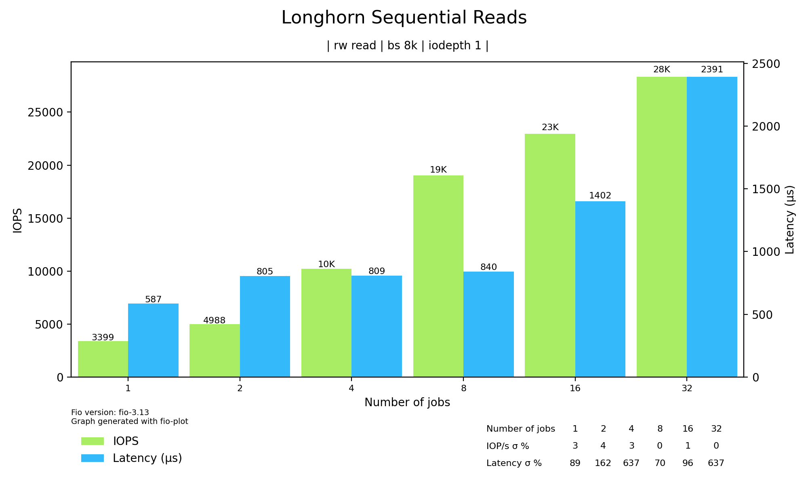
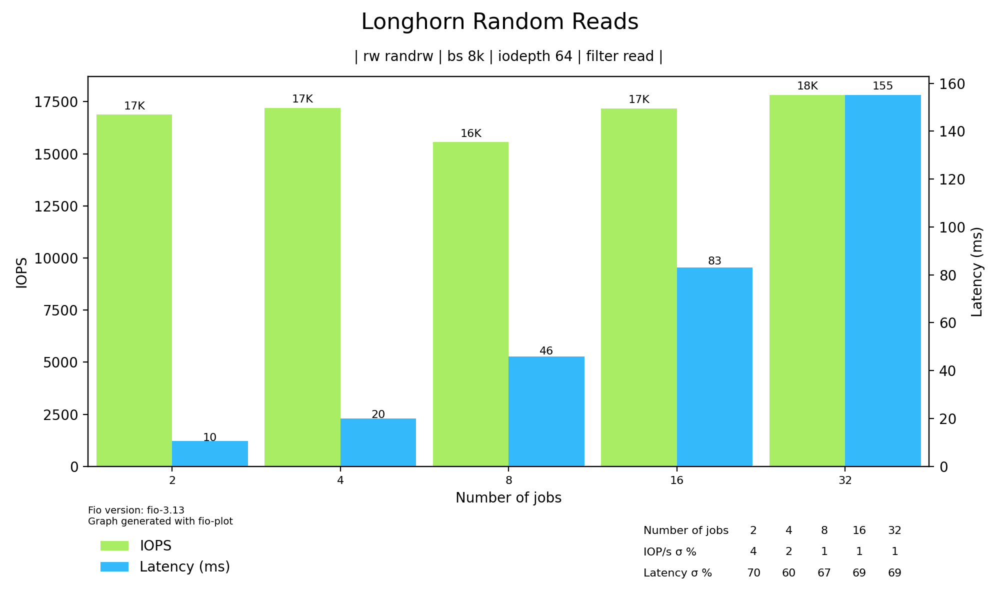
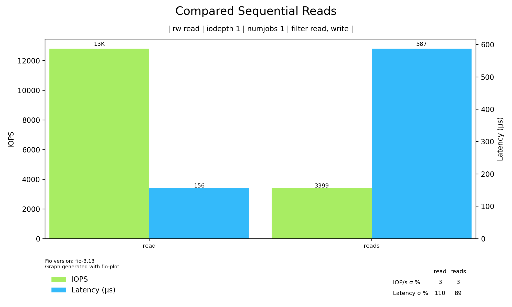

## Running fio and observing IO metrics

1. Longhorn

Using biolatency on the mounted disk (/dev/sde, the block device created and mounted by Longhorn on the host):

```bash
ideweiiss8508:/usr/share/bcc/tools # ./biolatency -d sde
Tracing block device I/O... Hit Ctrl-C to end.
^C
     usecs               : count     distribution
         0 -> 1          : 0        |                                        |
         2 -> 3          : 0        |                                        |
         4 -> 7          : 0        |                                        |
         8 -> 15         : 0        |                                        |
        16 -> 31         : 0        |                                        |
        32 -> 63         : 0        |                                        |
        64 -> 127        : 0        |                                        |
       128 -> 255        : 0        |                                        |
       256 -> 511        : 4        |                                        |
       512 -> 1023       : 19976    |                                        |
      1024 -> 2047       : 895601   |****************************************|
      2048 -> 4095       : 323932   |**************                          |
      4096 -> 8191       : 20611    |                                        |
      8192 -> 16383      : 1544     |                                        |
     16384 -> 32767      : 68       |                                        |
```

The same can be done using a bpftrace script that traces only for one PID [(link)](scripts/pid_latency.bt):

```bash
#!/usr/bin/env bpftrace

BEGIN
{
    printf("Monitoring fio I/O latency...\n");
    @fio_pid = $1;
}

tracepoint:block:block_rq_issue
/@fio_pid && pid == @fio_pid/
{
    @timestamps[args->dev, args->sector] = nsecs;
}

tracepoint:block:block_rq_complete
/@fio_pid && @timestamps[args->dev, args->sector]/
{
        $latency_ns = nsecs - @timestamps[args->dev, args->sector];
        @usecs = hist($latency_ns / 1000);
        delete(@timestamps[args->dev, args->sector]);
}
```

With the fio PID attached:

```bash
./pid_latency.bt 3337624
Attaching 3 probes...
Monitoring pgbench for I/O latency...

@pgbench_pid: 3337624

@usecs:
[256, 512)            42 |                                                    |
[512, 1K)          70886 |@@@@@@@@@@@@@@@@@@@@@@@@@@@@@@@@@@@@@@@@@@@@@@@@@@@@|
[1K, 2K)            1948 |@                                                   |
[2K, 4K)            1010 |                                                    |
[4K, 8K)             557 |                                                    |
[8K, 16K)             23 |                                                    |
[16K, 32K)             1 |                                                    |
```

Using blktrace on the block device that was created for the fio run, we get the following results:

```text
  8,80   1   126283   121.238929396 3328328  P   N [fio]
  8,80   1   126284   121.238929602 3328328  U   N [fio] 1
  8,80   1   126285   121.238930360 3328328  I  WS 1457344 + 16 [fio]
  8,80   1   126286   121.238934424 3328328  D  WS 1457344 + 16 [fio]
  8,80   1   126287   121.239531175     0  C  WS 1457344 + 16 [0]
  8,80   1   126288   121.239545541 3328328  Q  WS 1457360 + 16 [fio]
  8,80   1   126289   121.239547010 3328328  G  WS 1457360 + 16 [fio]
[...]
Total (8,80):
 Reads Queued:           1,        4KiB  Writes Queued:     143,304,    1,146MiB
 Read Dispatches:        1,        4KiB  Write Dispatches:  143,265,    1,146MiB
 Reads Requeued:         0               Writes Requeued:         0
 Reads Completed:        1,        4KiB  Writes Completed:  143,265,    1,146MiB
 Read Merges:            0,        0KiB  Write Merges:           39,      156KiB
 IO unplugs:       143,235               Timer unplugs:           1

Throughput (R/W): 0KiB/s / 9,119KiB/s
Events (8,80): 1,002,880 entries
Skips: 0 forward (0 -   0.0%)
```

We can see the throughput and that it was a fio run with the option `--rw=write`.

2. Local-Path

Observing io latency with biolatency the same way:

```bash
./biolatency -d sda
Tracing block device I/O... Hit Ctrl-C to end.
     usecs               : count     distribution
         0 -> 1          : 0        |                                        |
         2 -> 3          : 0        |                                        |
         4 -> 7          : 0        |                                        |
         8 -> 15         : 0        |                                        |
        16 -> 31         : 0        |                                        |
        32 -> 63         : 0        |                                        |
        64 -> 127        : 0        |                                        |
       128 -> 255        : 268687   |****************************************|
       256 -> 511        : 59086    |********                                |
       512 -> 1023       : 1585     |                                        |
      1024 -> 2047       : 451      |                                        |
      2048 -> 4095       : 203      |                                        |
      4096 -> 8191       : 10       |                                        |
      8192 -> 16383      : 0        |                                        |
     16384 -> 32767      : 2        |                                        |
```

Latency is significantly lower with the local-path provider.

Running blktrace leads the following results:

```text
Total (8,0):
 Reads Queued:          81,    2,128KiB  Writes Queued:     681,800,    3,635MiB
 Read Dispatches:       81,    2,128KiB  Write Dispatches:  452,302,    3,635MiB
 Reads Requeued:         0               Writes Requeued:         0
 Reads Completed:       81,    2,128KiB  Writes Completed:  452,302,    3,635MiB
 Read Merges:            0,        0KiB  Write Merges:      229,501,  918,040KiB
 IO unplugs:       451,610               Timer unplugs:          48

Throughput (R/W): 16KiB/s / 27,952KiB/s
Events (8,0): 4,306,115 entries
Skips: 0 forward (0 -   0.0%)
```

In this case I ran blktrace on the block device containing the local-path volume, but Kubernetes-native IO is done on the same block device, too.
As a result we see a small Read workload in the blktrace results (from Kubernetes management components) - even though fio was run with the `--rw=write` option.

TODO run biolatency, blktrace, bpftrace script on pid

---

IOPs and throughput can also be observed with e.g. iostat:

```text
# iostat -sxz 1
Linux 6.4.0-150600.23.22-default        12/11/24        _x86_64_        (4 CPU)
avg-cpu:  %user   %nice %system %iowait  %steal   %idle
           3.28    0.00    2.02   22.98    0.00   71.72

Device             tps      kB/s    rqm/s   await aqu-sz  areq-sz  %util
sda            3898.00  31180.00  3889.00    0.25   0.96     8.00 100.00
dm-1           7787.00  31180.00     0.00    0.25   1.93     4.00 100.00
```

## Comparing local-path and Longhorn storage providers

Longhorn: Block storage, with snapshots/backups/other enterprise features; local-path: only provides a node-local volume for the container.
TODO add upstream links

### Benchmarking I/Ops and I/O Latency

Running fio as a container in Kubernetes: sequential and random read/write workloads





Performance for both providers compared (numjobs=1, iodepth=1):



The speed difference is also explained in the following comment: <https://github.com/longhorn/longhorn/issues/1104#issuecomment-598826969>

Opensnoop results (files that the fio process opens):

```bash
# pgrep fio | xargs -I{} ./opensnoop -p {}
PID    COMM               FD ERR PATH
931449 fio                 4   0 /sys/block/sde/stat
931449 fio                 4   0 /sys/block/sde/stat
931449 fio                 4   0 /sys/block/sde/stat
931449 fio                 4   0 /sys/block/sde/stat
931449 fio                 4   0 /sys/block/sde/stat
931449 fio                 4   0 /sys/block/sde/stat
```

fio interacts with /sys/block/<disk-name>/stat to get disk statistics.

## Benchmarking a PostgreSQL database workload with pgbench

##### Script that gets pgbench PID, and traces block_rq_(issue|insert|complete) tracepoints (IOps):
TODO: really count IO instead of displaying events -> iostat, iotop
```bash
#!/usr/bin/env bpftrace

BEGIN
{
    printf("Monitoring for new `pgbench` process creations...\n");
}

// Trace process creation (execve)
tracepoint:syscalls:sys_enter_execve
/comm == "pgbench"/
{
    @target_pid = pid; // Store the `pgbench` PID
    printf("pgbench started with PID: %d\n", pid);
}

// Trace block requests when they are inserted into the queue
tracepoint:block:block_rq_insert
/@target_pid && pid == @target_pid/
{
    printf("INSERT: PID=%d, dev=%d:%d, sector=%llu, bytes=%u, rw=%s\n",
           pid,
           args->dev >> 20, args->dev & 0xfffff, // Major and minor device numbers
           args->sector,
           args->nr_sector * 512, // Sector size in bytes
           args->rwbs);
}

// Trace block requests when they are issued to the device
tracepoint:block:block_rq_issue
/@target_pid && pid == @target_pid/
{
    printf("ISSUE: PID=%d, dev=%d:%d, sector=%llu, bytes=%u, rw=%s\n",
           pid,
           args->dev >> 20, args->dev & 0xfffff,
           args->sector,
           args->nr_sector * 512,
           args->rwbs);
}

// Trace block requests when they are completed
tracepoint:block:block_rq_complete
/@target_pid && pid == @target_pid/
{
    printf("COMPLETE: PID=%d, dev=%d:%d, sector=%llu, bytes=%u, result=%d\n",
           pid,
           args->dev >> 20, args->dev & 0xfffff,
           args->sector,
           args->nr_sector * 512,
           args->error);
}
```

##### Script Results:

```text
# ./blk_io.bt
Attaching 5 probes...
Monitoring for new `pgbench` process creations...
pgbench started with PID: 3449590
INSERT: PID=3449590, dev=8:0, sector=46387496, bytes=16384, rw=RA
ISSUE: PID=3449590, dev=8:0, sector=46387496, bytes=16384, rw=RA
INSERT: PID=3449590, dev=8:0, sector=46387528, bytes=184320, rw=RA
ISSUE: PID=3449590, dev=8:0, sector=46387528, bytes=184320, rw=RA
INSERT: PID=3449590, dev=8:0, sector=29863448, bytes=4096, rw=RA
ISSUE: PID=3449590, dev=8:0, sector=29863448, bytes=4096, rw=RA
INSERT: PID=3449590, dev=8:0, sector=29484856, bytes=4096, rw=RM
INSERT: PID=3449590, dev=8:0, sector=29864976, bytes=16384, rw=RA
ISSUE: PID=3449590, dev=8:0, sector=29864976, bytes=16384, rw=RA
INSERT: PID=3449590, dev=8:0, sector=29865008, bytes=12288, rw=RA
ISSUE: PID=3449590, dev=8:0, sector=29865008, bytes=12288, rw=RA
INSERT: PID=3449590, dev=8:0, sector=29469376, bytes=4096, rw=RM
INSERT: PID=3449590, dev=8:0, sector=62505400, bytes=282624, rw=RA
ISSUE: PID=3449590, dev=8:0, sector=62505400, bytes=282624, rw=RA
INSERT: PID=3449590, dev=8:0, sector=62506024, bytes=57344, rw=RA
ISSUE: PID=3449590, dev=8:0, sector=62506024, bytes=57344, rw=RA
INSERT: PID=3449590, dev=8:0, sector=62506136, bytes=36864, rw=RA
ISSUE: PID=3449590, dev=8:0, sector=62506136, bytes=36864, rw=RA
COMPLETE: PID=3449590, dev=8:0, sector=62506136, bytes=36864, result=0
INSERT: PID=3449590, dev=8:0, sector=71849440, bytes=12288, rw=RA
ISSUE: PID=3449590, dev=8:0, sector=71849440, bytes=12288, rw=RA
COMPLETE: PID=3449590, dev=8:16, sector=53178064, bytes=8192, result=0
COMPLETE: PID=3449590, dev=8:32, sector=2447400, bytes=4096, result=0
COMPLETE: PID=3449590, dev=8:64, sector=6938832, bytes=8192, result=0
```

##### IO throughput with iotop (filtering on pid)

```text
Total DISK READ :       0.00 B/s | Total DISK WRITE :       0.00 B/s
Actual DISK READ:       2.72 M/s | Actual DISK WRITE:      10.29 M/s
TID  PRIO  USER     DISK READ  DISK WRITE  SWAPIN     IO>    COMMAND
549976 be/4 26          0.00 B/s    0.00 B/s  ?unavailable?  pgbench --client 1 --jobs 1 --time 30
```

```text
Total DISK READ :       3.25 M/s | Total DISK WRITE :       6.72 M/s
Actual DISK READ:       3.26 M/s | Actual DISK WRITE:       9.79 M/s

TID  PRIO  USER     DISK READ  DISK WRITE  SWAPIN     IO>    COMMAND
567937 be/4 26          3.25 M/s    6.72 M/s  ?unavailable?  postgres: postgres-test: app app 10.42.1.138(49130) UPDATE
```

One can see that the `postgres` process (the database itself) does the IO, not pgbench

The same using biotop, 5-second summaries, filter by pid:

```text
./biotop -p 563578 5
12:33:52 loadavg: 1.96 1.47 0.86 3/1826 564393

PID     COMM             D MAJ MIN DISK       I/O  Kbytes  AVGms
563578  postgres         R 8   64  sde       3590 50280.0   1.11

12:33:54 loadavg: 1.96 1.47 0.86 1/1826 564401

PID     COMM             D MAJ MIN DISK       I/O  Kbytes  AVGms
563578  postgres         R 8   64  sde       1220 17612.0   1.12
Detaching...
```

##### biolatency results while running pgbench

time=30, clients=1, jobs=1

```bash
# ./biolatency -m -d sde -e
Tracing block device I/O... Hit Ctrl-C to end.
^C
     msecs               : count     distribution
         0 -> 1          : 17603    |****************************************|
         2 -> 3          : 2897     |******                                  |
         4 -> 7          : 654      |*                                       |
         8 -> 15         : 33       |                                        |
        16 -> 31         : 1        |                                        |
        32 -> 63         : 0        |                                        |
        64 -> 127        : 1        |                                        |

avg = 0 msecs, total: 15563 msecs, count: 21189
```

clients=10:

```bash
# ./biolatency -m -d sde -e
Tracing block device I/O... Hit Ctrl-C to end.
^C
     msecs               : count     distribution
         0 -> 1          : 57666    |****************************************|
         2 -> 3          : 41545    |****************************            |
         4 -> 7          : 4833     |***                                     |
         8 -> 15         : 295      |                                        |
        16 -> 31         : 31       |                                        |
        32 -> 63         : 159      |                                        |
        64 -> 127        : 46       |                                        |
       128 -> 255        : 27       |                                        |

avg = 1 msecs, total: 175444 msecs, count: 104602
```

TODO: only add pid filter to bpftrace, print out histogram
TODO histogram and calculate average instead of adding values!

With bpftrace: filter by device and pgbench PID, get block_rq_issue and block_rq_complete events -> then calculate difference in time between them:

Script can be found [here](scripts/blk_debug.bt)

```bash
# cat out1.log
Attaching 4 probes...
Monitoring pgbench for I/O latency...
pgbench started with PID: 471595
ISSUE: PID=471595, sector=46387496, dev=8388608
COMPLETE: sector=46387496, latency=198461 ns
ISSUE: PID=471595, sector=46387528, dev=8388608
COMPLETE: sector=46387528, latency=458844 ns
ISSUE: PID=471595, sector=29864976, dev=8388608
COMPLETE: sector=29864976, latency=189674 ns
ISSUE: PID=471595, sector=29865008, dev=8388608
COMPLETE: sector=29865008, latency=171986 ns
```

Add up latencies: `198461 + 458844 + 189674 + 171986 ns = 1018965 ns = 1,02ms`

However pgbench itself reports a latency avg of 2,87ms:

```text
pgbench (17.0 (Debian 17.0-1.pgdg110+1))
[...]
latency average = 2.873 ms
initial connection time = 9.289 ms 
tps = 348.055502 (without initial connection time)
```

Reference: biolatency without pgbench load

```bash
# ./biolatency -m -d sde -e
Tracing block device I/O... Hit Ctrl-C to end.
^C
     msecs               : count     distribution
         0 -> 1          : 297      |*****************                       |
         2 -> 3          : 675      |****************************************|
         4 -> 7          : 28       |*                                       |

avg = 1 msecs, total: 1909 msecs, count: 1000
```
