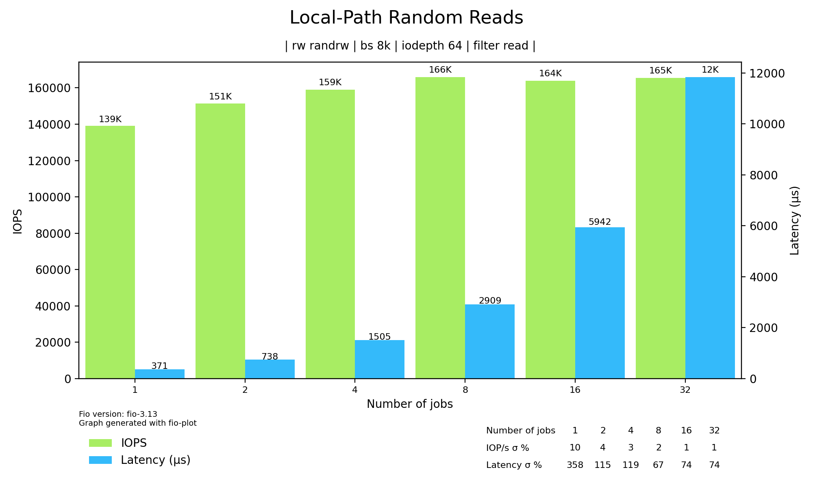

## Benchmarking IO with fio 

### 1. Longhorn

Using biolatency on the mounted disk (/dev/sde, the block device created and mounted by Longhorn on the host):

```bash
ideweiiss8508:/usr/share/bcc/tools # ./biolatency -d sde
Tracing block device I/O... Hit Ctrl-C to end.

     usecs               : count     distribution
         0 -> 1          : 0        |                                        |
         2 -> 3          : 0        |                                        |
         4 -> 7          : 0        |                                        |
         8 -> 15         : 0        |                                        |
        16 -> 31         : 0        |                                        |
        32 -> 63         : 0        |                                        |
        64 -> 127        : 0        |                                        |
       128 -> 255        : 0        |                                        |
       256 -> 511        : 4        |                                        |
       512 -> 1023       : 19976    |                                        |
      1024 -> 2047       : 895601   |****************************************|
      2048 -> 4095       : 323932   |**************                          |
      4096 -> 8191       : 20611    |                                        |
      8192 -> 16383      : 1544     |                                        |
     16384 -> 32767      : 68       |                                        |
```

The same can be done using a bpftrace script that traces only for one PID [(link)](scripts/pid_latency.bt):

```bash
#!/usr/bin/env bpftrace

BEGIN
{
    printf("Monitoring fio I/O latency...\n");
    @fio_pid = $1;
}

tracepoint:block:block_rq_issue
/@fio_pid && pid == @fio_pid/
{
    @timestamps[args->dev, args->sector] = nsecs;
}

tracepoint:block:block_rq_complete
/@fio_pid && @timestamps[args->dev, args->sector]/
{
        $latency_ns = nsecs - @timestamps[args->dev, args->sector];
        @usecs = hist($latency_ns / 1000);
        delete(@timestamps[args->dev, args->sector]);
}
```

With the fio PID attached:

```bash
./pid_latency.bt 3337624
Attaching 3 probes...
Monitoring pgbench for I/O latency...

@pgbench_pid: 3337624

@usecs:
[256, 512)            42 |                                                    |
[512, 1K)          70886 |@@@@@@@@@@@@@@@@@@@@@@@@@@@@@@@@@@@@@@@@@@@@@@@@@@@@|
[1K, 2K)            1948 |@                                                   |
[2K, 4K)            1010 |                                                    |
[4K, 8K)             557 |                                                    |
[8K, 16K)             23 |                                                    |
[16K, 32K)             1 |                                                    |
```

Using blktrace on the block device that was created for the fio run, we get the following results:

```text
  8,80   1   126283   121.238929396 3328328  P   N [fio]
  8,80   1   126284   121.238929602 3328328  U   N [fio] 1
  8,80   1   126285   121.238930360 3328328  I  WS 1457344 + 16 [fio]
  8,80   1   126286   121.238934424 3328328  D  WS 1457344 + 16 [fio]
  8,80   1   126287   121.239531175     0  C  WS 1457344 + 16 [0]
  8,80   1   126288   121.239545541 3328328  Q  WS 1457360 + 16 [fio]
  8,80   1   126289   121.239547010 3328328  G  WS 1457360 + 16 [fio]
[...]
Total (8,80):
 Reads Queued:           1,        4KiB  Writes Queued:     143,304,    1,146MiB
 Read Dispatches:        1,        4KiB  Write Dispatches:  143,265,    1,146MiB
 Reads Requeued:         0               Writes Requeued:         0
 Reads Completed:        1,        4KiB  Writes Completed:  143,265,    1,146MiB
 Read Merges:            0,        0KiB  Write Merges:           39,      156KiB
 IO unplugs:       143,235               Timer unplugs:           1

Throughput (R/W): 0KiB/s / 9,119KiB/s
Events (8,80): 1,002,880 entries
Skips: 0 forward (0 -   0.0%)
```

We can see the throughput and that it was a fio run with the option `--rw=write`.

### 2. Local-Path

Observing io latency with biolatency the same way:

```bash
./biolatency -d sda
Tracing block device I/O... Hit Ctrl-C to end.
     usecs               : count     distribution
         0 -> 1          : 0        |                                        |
         2 -> 3          : 0        |                                        |
         4 -> 7          : 0        |                                        |
         8 -> 15         : 0        |                                        |
        16 -> 31         : 0        |                                        |
        32 -> 63         : 0        |                                        |
        64 -> 127        : 0        |                                        |
       128 -> 255        : 268687   |****************************************|
       256 -> 511        : 59086    |********                                |
       512 -> 1023       : 1585     |                                        |
      1024 -> 2047       : 451      |                                        |
      2048 -> 4095       : 203      |                                        |
      4096 -> 8191       : 10       |                                        |
      8192 -> 16383      : 0        |                                        |
     16384 -> 32767      : 2        |                                        |
```

Latency is significantly lower with the local-path provider.

Latency histogram only for the fio PID:

```bash
# ./pid_latency.bt 3932726
Attaching 4 probes...
Monitoring pgbench for I/O latency...
Average latency: 251503 ns


@io_count: 192631
@pgbench_pid: 3932726
@timestamps[8388608, 131681088]: 5317419757495715
@timestamps[8388608, 131681104]: 5317419757769517
@timestamps[8388608, 131681120]: 5317419758020993
@timestamps[8388608, 131681136]: 5317419758268440
@total_latency_ns: 48447434813
@usecs:
[128, 256)        152464 |@@@@@@@@@@@@@@@@@@@@@@@@@@@@@@@@@@@@@@@@@@@@@@@@@@@@|
[256, 512)         39032 |@@@@@@@@@@@@@                                       |
[512, 1K)            770 |                                                    |
[1K, 2K)             286 |                                                    |
[2K, 4K)              79 |                                                    |
```

Average latency displayed is about 0,25ms.

Running blktrace leads the following results:

```text
Total (8,0):
 Reads Queued:          81,    2,128KiB  Writes Queued:     681,800,    3,635MiB
 Read Dispatches:       81,    2,128KiB  Write Dispatches:  452,302,    3,635MiB
 Reads Requeued:         0               Writes Requeued:         0
 Reads Completed:       81,    2,128KiB  Writes Completed:  452,302,    3,635MiB
 Read Merges:            0,        0KiB  Write Merges:      229,501,  918,040KiB
 IO unplugs:       451,610               Timer unplugs:          48

Throughput (R/W): 16KiB/s / 27,952KiB/s
Events (8,0): 4,306,115 entries
Skips: 0 forward (0 -   0.0%)
```

In this case I ran blktrace on the block device containing the local-path volume, but Kubernetes-native IO is done on the same block device, too.
As a result we see a small Read workload in the blktrace results (from Kubernetes management components) - even though fio was run with the `--rw=write` option.

---

IOps (column tps) and throughput (column kB/s) can also be observed with e.g. iostat:

For the Longhorn provider, iostat output looks like this:
(/dev/sdf, because Longhorn volumes are mounted as an extra block device on the hosts):

```text
# iostat -sxz 1
Linux 6.4.0-150600.23.22-default        12/11/24        _x86_64_        (4 CPU)
avg-cpu:  %user   %nice %system %iowait  %steal   %idle
           9.02    0.00   11.03    0.00    0.00   79.95

Device             tps      kB/s    rqm/s   await aqu-sz  areq-sz  %util
sdc               1.00      4.00     0.00    1.00   0.00     4.00   0.40
sdf            1354.00  10832.00     0.00    0.71   0.96     8.00 100.00
```

And for the local-path provider: 

```text
# iostat -sxz 1
Linux 6.4.0-150600.23.22-default        12/11/24        _x86_64_        (4 CPU)
avg-cpu:  %user   %nice %system %iowait  %steal   %idle
           3.28    0.00    2.02   22.98    0.00   71.72

Device             tps      kB/s    rqm/s   await aqu-sz  areq-sz  %util
sda            3898.00  31180.00  3889.00    0.25   0.96     8.00 100.00
dm-1           7787.00  31180.00     0.00    0.25   1.93     4.00 100.00
```

`dm-1` in this case is a logical volume. Using the command

```bash
# ls -la /dev/mapper/
total 0
drwxr-xr-x  2 root root     180 Oct 11 09:22 .
drwxr-xr-x 20 root root    4280 Dec 11 15:56 ..
lrwxrwxrwx  1 root root       7 Oct 11 09:22 lvdocker -> ../dm-0
lrwxrwxrwx  1 root root       7 Oct 11 09:22 lvk8s -> ../dm-1
[...]
```

we can see that the corresponding LV name is `lvk8s`, which in this case is mounted to `/opt/k8s`.

```bash
# lsblk
NAME              MAJ:MIN RM  SIZE RO TYPE MOUNTPOINTS
sda                 8:0    0  150G  0 disk
├─lvdocker        254:0    0   40G  0 lvm  /var/lib/docker
└─lvk8s           254:1    0  100G  0 lvm  /opt/k8s
[...]
```

Both of these values can also be observed using biotop:

```bash
# ./biotop -r 5 -C 5
Tracing... Output every 5 secs. Hit Ctrl-C to end

20:29:16 loadavg: 0.26 0.45 0.56 2/1905 3833460

PID     COMM             D MAJ MIN DISK       I/O  Kbytes  AVGms
3833308 fio              R 8   80  sdf       5589 44712.0   0.70
924     jbd2/dm-0-8      R 8   0   sda         78  2816.0   0.41
3833290 sleep            R 8   0   sda         16  1828.0   1.20
2700    dockerd          R 8   0   sda        309  1516.0   0.43
3833245 fio              R 8   0   sda         31   844.0   1.12
```

## Comparing local-path and Longhorn storage providers

Longhorn: Block storage, with snapshots/backups/other enterprise features; local-path: only provides a node-local volume for the container.
TODO add upstream links

### Benchmarking I/Ops and I/O Latency

Running fio as a container in Kubernetes: sequential and random read/write workloads




Performance for both providers compared (numjobs=1, iodepth=1) - Local-Path on the left, Longhorn on the right:


The speed difference is also explained in the following comment: <https://github.com/longhorn/longhorn/issues/1104#issuecomment-598826969>

More comparison plots can be found in the [fio-plots folder](fio-plots/).

Opensnoop results (files that the fio process opens):

```bash
# pgrep fio | xargs -I{} ./opensnoop -p {}
PID    COMM               FD ERR PATH
931449 fio                 4   0 /sys/block/sde/stat
931449 fio                 4   0 /sys/block/sde/stat
931449 fio                 4   0 /sys/block/sde/stat
931449 fio                 4   0 /sys/block/sde/stat
931449 fio                 4   0 /sys/block/sde/stat
931449 fio                 4   0 /sys/block/sde/stat
```

fio interacts with /sys/block/<disk-name>/stat to get disk statistics.

## Benchmarking a PostgreSQL database workload with pgbench

### 1. Longhorn

##### IO throughput with iotop (filtering on pid)

```text
Total DISK READ :       0.00 B/s | Total DISK WRITE :       0.00 B/s
Actual DISK READ:       2.72 M/s | Actual DISK WRITE:      10.29 M/s
TID  PRIO  USER     DISK READ  DISK WRITE  SWAPIN     IO>    COMMAND
549976 be/4 26          0.00 B/s    0.00 B/s  ?unavailable?  pgbench --client 1 --jobs 1 --time 30
```

```text
Total DISK READ :       3.25 M/s | Total DISK WRITE :       6.72 M/s
Actual DISK READ:       3.26 M/s | Actual DISK WRITE:       9.79 M/s

TID  PRIO  USER     DISK READ  DISK WRITE  SWAPIN     IO>    COMMAND
567937 be/4 26          3.25 M/s    6.72 M/s  ?unavailable?  postgres: postgres-test: app app 10.42.1.138(49130) UPDATE
```

One can see that the `postgres` process (the database itself) does the IO, not pgbench.

The same using biotop, 5-second summaries, filter by pid:

```text
./biotop -p 563578 5
12:33:52 loadavg: 1.96 1.47 0.86 3/1826 564393

PID     COMM             D MAJ MIN DISK       I/O  Kbytes  AVGms
563578  postgres         R 8   64  sde       3590 50280.0   1.11

12:33:54 loadavg: 1.96 1.47 0.86 1/1826 564401

PID     COMM             D MAJ MIN DISK       I/O  Kbytes  AVGms
563578  postgres         R 8   64  sde       1220 17612.0   1.12
Detaching...
```

##### biolatency results while running pgbench

time=30, clients=1, jobs=1

```bash
# ./biolatency -m -d sde -e
Tracing block device I/O... Hit Ctrl-C to end.

     msecs               : count     distribution
         0 -> 1          : 17603    |****************************************|
         2 -> 3          : 2897     |******                                  |
         4 -> 7          : 654      |*                                       |
         8 -> 15         : 33       |                                        |
        16 -> 31         : 1        |                                        |
        32 -> 63         : 0        |                                        |
        64 -> 127        : 1        |                                        |

avg = 0 msecs, total: 15563 msecs, count: 21189
```

clients=10:

```bash
# ./biolatency -m -d sde -e
Tracing block device I/O... Hit Ctrl-C to end.

     msecs               : count     distribution
         0 -> 1          : 57666    |****************************************|
         2 -> 3          : 41545    |****************************            |
         4 -> 7          : 4833     |***                                     |
         8 -> 15         : 295      |                                        |
        16 -> 31         : 31       |                                        |
        32 -> 63         : 159      |                                        |
        64 -> 127        : 46       |                                        |
       128 -> 255        : 27       |                                        |

avg = 1 msecs, total: 175444 msecs, count: 104602
```

Then I also used the [pid_latency.bt script](scripts/pid_latency.bt) to create an IO latency histogram for the pgbench run:

```bash
# ./pid_latency.bt 3888616
Monitoring pgbench for I/O latency...
Average latency: 1306526 ns


@io_count: 23877
@pgbench_pid: 3888616
@timestamps[8388672, 3849104]: 5315885357502770
@total_latency_ns: 31195945024
@usecs:
[128, 256)            66 |                                                    |
[256, 512)            55 |                                                    |
[512, 1K)          13140 |@@@@@@@@@@@@@@@@@@@@@@@@@@@@@@@@@@@@@@@@@@@@@@@@@@@@|
[1K, 2K)            8573 |@@@@@@@@@@@@@@@@@@@@@@@@@@@@@@@@@                   |
[2K, 4K)            1296 |@@@@@                                               |
[4K, 8K)             647 |@@                                                  |
[8K, 16K)             87 |                                                    |
[16K, 32K)             5 |                                                    |
[32K, 64K)             6 |                                                    |
[64K, 128K)            2 |                                                    |
```

The average latency was about 1,3ms here (pgbench settings: 1 client, 1 job).

However pgbench itself reports a latency avg of 2,87ms:

```text
pgbench (17.0 (Debian 17.0-1.pgdg110+1))
[...]
latency average = 2.873 ms
initial connection time = 9.289 ms 
tps = 348.055502 (without initial connection time)
```

TODO why is that?
TODO pgbench local-path 

### 2. Local-Path

Analogically monitoring the latency distribution with biolatency:

```bash
./biolatency -d sda
Tracing block device I/O... Hit Ctrl-C to end.
^C
     usecs               : count     distribution
         0 -> 1          : 0        |                                        |
         2 -> 3          : 0        |                                        |
         4 -> 7          : 0        |                                        |
         8 -> 15         : 0        |                                        |
        16 -> 31         : 0        |                                        |
        32 -> 63         : 0        |                                        |
        64 -> 127        : 21       |                                        |
       128 -> 255        : 26584    |****************                        |
       256 -> 511        : 66021    |****************************************|
       512 -> 1023       : 38016    |***********************                 |
      1024 -> 2047       : 3536     |**                                      |
      2048 -> 4095       : 333      |                                        |
      4096 -> 8191       : 88       |                                        |
      8192 -> 16383      : 24       |                                        |
     16384 -> 32767      : 28       |                                        |
     32768 -> 65535      : 56       |                                        |
     65536 -> 131071     : 34       |                                        |
    131072 -> 262143     : 1        |                                        |
```

Here we can see results similar to the fio tests - latency is significantly lower on average than for the Longhorn provider (block storage).

Afterwards I also looked at the latency distribution for the postgres pid only:

```bash
./pid_latency.bt 3655804
Attaching 4 probes...
Monitoring pgbench for I/O latency...
Average latency: 457314 ns


@io_count: 60748
@pgbench_pid: 3655804
@timestamps[8388608, 203462608]: 291469309421421
@timestamps[8388608, 210069408]: 291480919299663
@timestamps[8388608, 210127152]: 291488154966756
@timestamps[8388608, 210258688]: 291498673724290
@timestamps[8388608, 199844544]: 291499267562530
@timestamps[8388608, 210226288]: 291510238528823
@total_latency_ns: 27780922486
@usecs:
[64, 128)             10 |                                                    |
[128, 256)         25013 |@@@@@@@@@@@@@@@@@@@@@@@@@@@@@@@@@@@@@@@@@@@@@@@@@@@@|
[256, 512)         21049 |@@@@@@@@@@@@@@@@@@@@@@@@@@@@@@@@@@@@@@@@@@@         |
[512, 1K)          10603 |@@@@@@@@@@@@@@@@@@@@@@                              |
[1K, 2K)            3693 |@@@@@@@                                             |
[2K, 4K)             281 |                                                    |
[4K, 8K)              33 |                                                    |
[8K, 16K)             27 |                                                    |
[16K, 32K)             6 |                                                    |
[32K, 64K)            22 |                                                    |
[64K, 128K)           11 |                                                    |
```

Results match with the biolatency results, we can see less outliers that have high latency than in biolatency.
This can be because we're monitoring the whole sda disk with biolatency, and Kubernetes management component's IO operations are included there as well (opposing to when monitoring only the postgres PID).

I tried exploring this further in section [Measuring Postgres Latency](#measuring-postgres-latency).

##### Monitoring IOps and throughput with iostat/iotop

```bash
# iotop -bod 5
Total DISK READ :       2.03 M/s | Total DISK WRITE :      11.60 M/s
Actual DISK READ:       2.03 M/s | Actual DISK WRITE:      11.60 M/s
    TID  PRIO  USER     DISK READ  DISK WRITE  SWAPIN      IO    COMMAND
3677407 be/4 26          2.03 M/s   11.60 M/s  0.00 % 28.46 % postgres: postgres-test: app app 10.42.2.137(34914) INSERT

Total DISK READ :       3.12 M/s | Total DISK WRITE :      28.07 M/s
Actual DISK READ:       3.19 M/s | Actual DISK WRITE:      22.67 M/s
    TID  PRIO  USER     DISK READ  DISK WRITE  SWAPIN      IO    COMMAND
3677407 be/4 26          3.12 M/s   23.11 M/s  0.00 % 44.25 % postgres: postgres-test: app app 10.42.2.137(34914) idle in transaction
```


```bash
Linux 6.4.0-150600.23.22-default        12/12/24        _x86_64_        (4 CPU)
avg-cpu:  %user   %nice %system %iowait  %steal   %idle
          10.00    0.00    8.25    9.75    0.00   72.00

Device             tps      kB/s    rqm/s   await aqu-sz  areq-sz  %util
sda            1825.00  41656.00    29.00    0.44   0.81    22.83  99.20
dm-1           1845.00  41656.00     0.00    0.46   0.85    22.58  99.20

avg-cpu:  %user   %nice %system %iowait  %steal   %idle
          11.78    0.00    9.02    9.77    0.00   69.42

Device             tps      kB/s    rqm/s   await aqu-sz  areq-sz  %util
sda            5542.00  72436.00    37.00    0.51   2.83    13.07 100.00
sdb              18.00    172.00    25.00    0.44   0.01     9.56   1.60
sdc               5.00     72.00    13.00    0.80   0.00    14.40   0.80
dm-0             23.00     92.00     0.00    3.83   0.09     4.00   0.80
dm-1           5547.00  72368.00     0.00    0.48   2.69    13.05 100.00
dm-3             12.00     48.00     0.00    1.00   0.01     4.00   1.20
dm-5             31.00    124.00     0.00    0.00   0.00     4.00   0.80
```

Higher IOps and throughput values than for the Longhorn solution can be observed here as well. 

For reference: biolatency without pgbench load (lower number of captured operations)

```bash
# ./biolatency -d sde -e
Tracing block device I/O... Hit Ctrl-C to end.

     usecs               : count     distribution
         0 -> 1          : 0        |                                        |
         2 -> 3          : 0        |                                        |
         4 -> 7          : 0        |                                        |
         8 -> 15         : 0        |                                        |
        16 -> 31         : 0        |                                        |
        32 -> 63         : 0        |                                        |
        64 -> 127        : 0        |                                        |
       128 -> 255        : 0        |                                        |
       256 -> 511        : 0        |                                        |
       512 -> 1023       : 37       |*                                       |
      1024 -> 2047       : 391      |**************                          |
      2048 -> 4095       : 1060     |****************************************|
      4096 -> 8191       : 59       |**                                      |
      8192 -> 16383      : 20       |                                        |

avg = 2636 usecs, total: 4131653 usecs, count: 1567
```

### Measuring Postgres Latency
TODO

## Docker vs Kubernetes PostgreSQL Latency

### Docker:

Running pgbench:

```bash
# pgbench -i -s 250 -U postgres -h localhost postgres
dropping old tables...
NOTICE:  table "pgbench_accounts" does not exist, skipping
NOTICE:  table "pgbench_branches" does not exist, skipping
NOTICE:  table "pgbench_history" does not exist, skipping
NOTICE:  table "pgbench_tellers" does not exist, skipping
creating tables...
generating data (client-side)...
vacuuming...
creating primary keys...
done in 32.94 s (drop tables 0.00 s, create tables 0.00 s, client-side generate 22.34 s, vacuum 0.95 s, primary keys 9.65 s).


# pgbench -U postgres -c 1 -j 1 --time 60 postgres
pgbench (17.2 (Debian 17.2-1.pgdg120+1))
starting vacuum...end.
transaction type: <builtin: TPC-B (sort of)>
scaling factor: 250
query mode: simple
number of clients: 1
number of threads: 1
maximum number of tries: 1
duration: 60 s
number of transactions actually processed: 76177
number of failed transactions: 0 (0.000%)
latency average = 0.788 ms
initial connection time = 2.624 ms
tps = 1269.669697 (without initial connection time)
```

### Kubernetes - Local-Path provider

```bash
pgbench (17.0 (Debian 17.0-1.pgdg110+1))
starting vacuum...end.
transaction type: <builtin: TPC-B (sort of)>
scaling factor: 250
query mode: simple
number of clients: 1
number of threads: 1
maximum number of tries: 1
duration: 60 s
number of transactions actually processed: 54366
number of failed transactions: 0 (0.000%)
latency average = 1.103 ms
initial connection time = 9.019 ms
tps = 906.233398 (without initial connection time)
```

Running with 10 clients and opening a new connection for each query (`-C`), the difference is more noticeable:

Docker:

```bash
# pgbench -U postgres -c 10 -S -C --time 60 postgres
pgbench (17.2 (Debian 17.2-1.pgdg120+1))
[...]
number of clients: 10
number of transactions actually processed: 27313
number of failed transactions: 0 (0.000%)
latency average = 21.968 ms
average connection time = 2.180 ms
tps = 455.198254 (including reconnection times)
```

Kubernetes:

```bash
pgbench (17.0 (Debian 17.0-1.pgdg110+1))
[...]
number of clients: 10
number of transactions actually processed: 7472
latency average = 80.309 ms
average connection time = 7.988 ms
tps = 124.518810 (including reconnection times)
```

