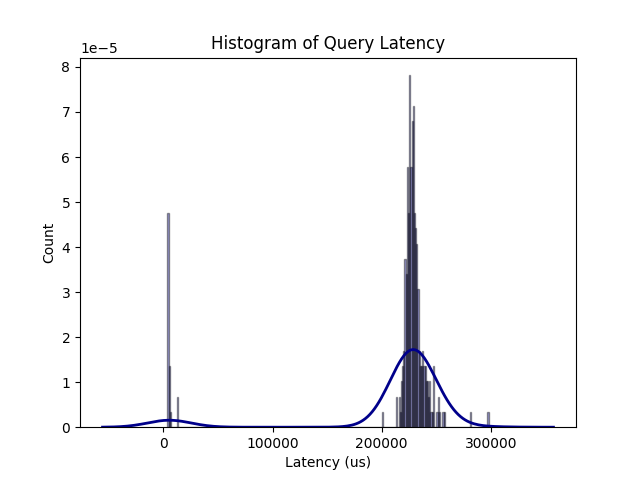

### Measuring time between read() and close()

Following up I measured the time between the read() and close() syscalls filtering by the Postgres PID, using bpftrace:

```text
PID: 3957814 Latency between read and close: 13303 ns
PID: 3957814 Latency between read and close: 1030 ns
PID: 3957814 Latency between read and close: 51277 ns
PID: 3957814 Latency between read and close: 8942 ns
PID: 3957814 Latency between read and close: 2420 ns
PID: 3957814 Latency between read and close: 1973 ns
PID: 3957814 Latency between read and close: 5289 ns
PID: 3878649 Latency between read and close: 23855668 ns
PID: 3957815 Latency between read and close: 3170 ns
PID: 3957815 Latency between read and close: 7027 ns
PID: 3957815 Latency between read and close: 1854 ns
PID: 3957815 Latency between read and close: 41833 ns
PID: 3957815 Latency between read and close: 8385 ns
PID: 3957815 Latency between read and close: 2555 ns
PID: 3957815 Latency between read and close: 1401 ns
PID: 3957815 Latency between read and close: 9808 ns
PID: 3878649 Latency between read and close: 40491687 ns
PID: 3957922 Latency between read and close: 2582 ns
PID: 3957922 Latency between read and close: 2538 ns
PID: 3957922 Latency between read and close: 5667 ns
PID: 3957922 Latency between read and close: 4096 ns
PID: 3957922 Latency between read and close: 1602 ns
PID: 3957922 Latency between read and close: 5535 ns
PID: 3957923 Latency between read and close: 2161 ns
PID: 3957923 Latency between read and close: 2658 ns
PID: 3957923 Latency between read and close: 5308 ns
PID: 3957923 Latency between read and close: 3578 ns
PID: 3957923 Latency between read and close: 1103 ns
PID: 3957923 Latency between read and close: 5469 ns
PID: 3878649 Latency between read and close: 1418293300 ns
PID: 3878649 Latency between read and close: 17154 ns
PID: 3958083 Latency between read and close: 3588 ns
PID: 3958083 Latency between read and close: 8587 ns
PID: 3958083 Latency between read and close: 1184 ns
PID: 3958083 Latency between read and close: 32214 ns
PID: 3958083 Latency between read and close: 8564 ns
PID: 3958083 Latency between read and close: 2539 ns
PID: 3958083 Latency between read and close: 2350 ns
PID: 3958083 Latency between read and close: 5734 ns
PID: 3878649 Latency between read and close: 24256531 ns
PID: 3958084 Latency between read and close: 2800 ns
PID: 3958084 Latency between read and close: 6885 ns
PID: 3958084 Latency between read and close: 1368 ns
PID: 3958084 Latency between read and close: 37764 ns
PID: 3958084 Latency between read and close: 7819 ns
PID: 3958084 Latency between read and close: 2346 ns
PID: 3958084 Latency between read and close: 1252 ns
PID: 3958084 Latency between read and close: 5052 ns
```

Latency outliers can be noticed, so I decided to print the time measurements as a histogram, using BPFtrace as well:

```text
@latency:
[0]                    1 |@@                                                  |
[1]                   11 |@@@@@@@@@@@@@@@@@@@@@@@@@@@@@@                      |
[2, 4)                16 |@@@@@@@@@@@@@@@@@@@@@@@@@@@@@@@@@@@@@@@@@@@         |
[4, 8)                19 |@@@@@@@@@@@@@@@@@@@@@@@@@@@@@@@@@@@@@@@@@@@@@@@@@@@@|
[8, 16)                3 |@@@@@@@@                                            |
[16, 32)               2 |@@@@@                                               |
[32, 64)               2 |@@@@@                                               |
[64, 128)              0 |                                                    |
[128, 256)             0 |                                                    |
[256, 512)             0 |                                                    |
[512, 1K)              0 |                                                    |
[1K, 2K)               0 |                                                    |
[2K, 4K)               0 |                                                    |
[4K, 8K)               0 |                                                    |
[8K, 16K)              0 |                                                    |
[16K, 32K)             2 |@@@@@                                               |
[32K, 64K)             0 |                                                    |
[64K, 128K)            0 |                                                    |
[128K, 256K)           0 |                                                    |
[256K, 512K)           1 |@@                                                  |
[512K, 1M)             0 |                                                    |
[1M, 2M)               0 |                                                    |
[2M, 4M)               0 |                                                    |
[4M, 8M)               1 |@@                                                  |
```

In the latency histogram, the "outliers" can be seen (these are the slow select queries that I fired using pgbench), the other read() statements in the 1-64us range are others that postgres does in the process. ERROR here data is probably just being read from cache (RAM)

We can observe a bi-modal distribution when looking at time from read() to close():

```
@latency:
[0]                    6 |                                                    |
[1]                  589 |@@@@@@@@@@@@@@@@@@@@@@@                             |
[2, 4)              1300 |@@@@@@@@@@@@@@@@@@@@@@@@@@@@@@@@@@@@@@@@@@@@@@@@@@@@|
[4, 8)              1291 |@@@@@@@@@@@@@@@@@@@@@@@@@@@@@@@@@@@@@@@@@@@@@@@@@@@ |
[8, 16)               50 |@@                                                  |
[16, 32)              12 |                                                    |
[32, 64)              25 |@                                                   |
[64, 128)              0 |                                                    |
[128, 256)             0 |                                                    |
[256, 512)             0 |                                                    |
[512, 1K)              0 |                                                    |
[1K, 2K)               0 |                                                    |
[2K, 4K)               1 |                                                    |
[4K, 8K)               1 |                                                    |
[8K, 16K)              1 |                                                    |
[16K, 32K)            15 |                                                    |
[32K, 64K)             4 |                                                    |
[64K, 128K)           10 |                                                    |
[128K, 256K)         481 |@@@@@@@@@@@@@@@@@@@                                 |
[256K, 512K)           9 |                                                    |
[512K, 1M)             0 |                                                    |
[1M, 2M)               0 |                                                    |
[2M, 4M)               2 |                                                    |
[4M, 8M)               0 |                                                    |
[8M, 16M)              1 |                                                    |
```

I ran the query 500 times, 482 of which had a latency of about ~220ms. The other read() statements in the 1-8us range are most probably smaller read operations, that are performed in the course of the query processing --> reading data from cache (RAM) is faster!.


Looking at strace for postgres again:

```console
# strace -e trace=all -p 3878649
strace: Process 3878649 attached
epoll_wait(10, [{events=EPOLLIN, data={u32=2759647744, u64=94431910617600}}], 4, 51549) = 1
accept(9, {sa_family=AF_UNIX}, [128 => 2]) = 11
getpid()                                = 21
getpid()                                = 21
rt_sigprocmask(SIG_SETMASK, ~[ILL TRAP ABRT BUS FPE SEGV CONT SYS RTMIN RT_1], [URG], 8) = 0
clone(child_stack=NULL, flags=CLONE_CHILD_CLEARTID|CLONE_CHILD_SETTID|SIGCHLD, child_tidptr=0x7f2d3c33bd10) = 32709
rt_sigprocmask(SIG_SETMASK, [URG], NULL, 8) = 0
close(11)                               = 0
epoll_wait(10, 0x55e2a47ce218, 4, 60000) = -1 EINTR (Interrupted system call)
--- SIGCHLD {si_signo=SIGCHLD, si_code=CLD_EXITED, si_pid=32709, si_uid=26, si_status=0, si_utime=0, si_stime=0} ---
getpid()                                = 21
kill(21, SIGURG)                        = 0
rt_sigreturn({mask=[URG]})              = -1 EINTR (Interrupted system call)
wait4(-1, [{WIFEXITED(s) && WEXITSTATUS(s) == 0}], WNOHANG, NULL) = 32709
wait4(-1, 0x7ffec8e7971c, WNOHANG, NULL) = 0
epoll_wait(10, [{events=EPOLLIN, data={u32=2759647672, u64=94431910617528}}], 4, 60000) = 1
read(3, "\27\0\0\0\0\0\0\0\0\0\0\0\25\0\0\0\32\0\0\0\0\0\0\0\0\0\0\0\0\0\0\0"..., 1024) = 128
epoll_wait(10, [{events=EPOLLIN, data={u32=2759647744, u64=94431910617600}}], 4, 60000) = 1
accept(9, {sa_family=AF_UNIX}, [128 => 2]) = 11
getpid()                                = 21
getpid()                                = 21
rt_sigprocmask(SIG_SETMASK, ~[ILL TRAP ABRT BUS FPE SEGV CONT SYS RTMIN RT_1], [URG], 8) = 0
clone(child_stack=NULL, flags=CLONE_CHILD_CLEARTID|CLONE_CHILD_SETTID|SIGCHLD, child_tidptr=0x7f2d3c33bd10) = 32710
rt_sigprocmask(SIG_SETMASK, [URG], NULL, 8) = 0
close(11)                               = 0
epoll_wait(10, 0x55e2a47ce218, 4, 60000) = -1 EINTR (Interrupted system call)
```

It seems like I had the wrong PID for the running postgres process the first time. Here we can observe that a new child process is spawned upon each select statement (new connection is made) -> clone()

Afterwards, there is a wait4() syscall that waits for the child process to exit. We can measure the time between these two syscalls to get the query latency (this does not contain network latency).
However this measurement contains e.g. scheduler latency as well, and e.g. if the child process has to wait, this wait time would be included in my measurement, too.

Measuring the time between clone() and wait4(): [script link](../scripts/clone_wait4.bt)

```console
# ./clone_wait4.bt
Attaching 3 probes...
Cloned process PID is 33611
Time for PID 33611 is 4590 us
Cloned process PID is 33612
Time for PID 33612 is 4075 us
Cloned process PID is 33614
Time for PID 33614 is 6023 us
Cloned process PID is 33615
Cloned process PID is 33616
Time for PID 33615 is 11690 us
Cloned process PID is 33617
Time for PID 33616 is 288260 us
Cloned process PID is 33618
Time for PID 33617 is 236352 us
Cloned process PID is 33619
Time for PID 33618 is 235468 us
Cloned process PID is 33620
Time for PID 33619 is 229311 us
```

As I ran 20 queries, PID 33616 is the first select statement being executed (response time ~288ms).

Plotting the results as well as the distribution: 